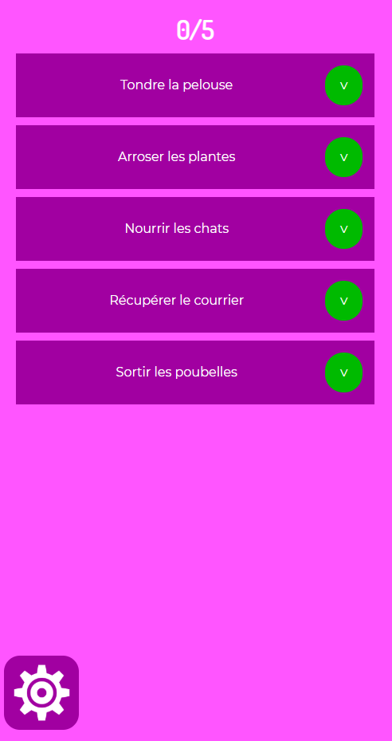
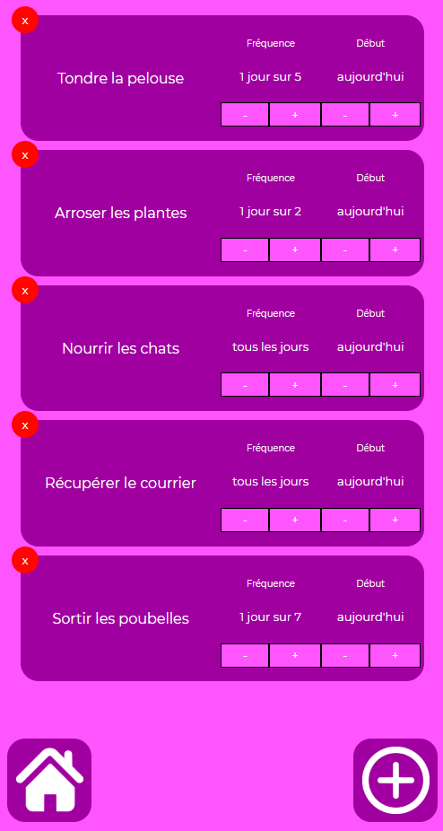
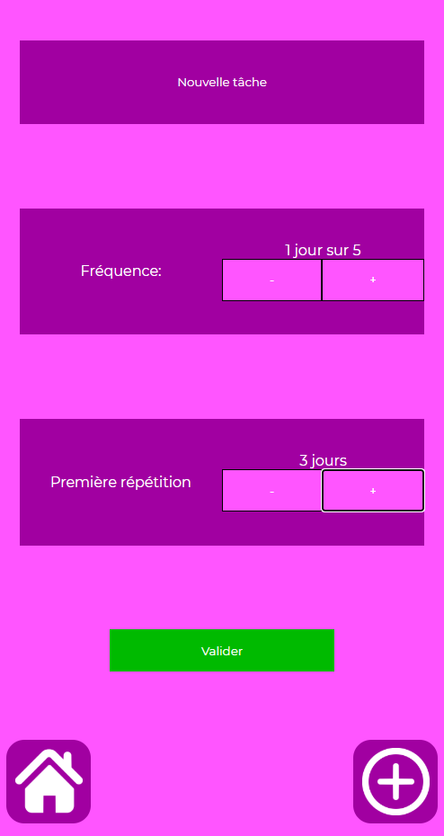
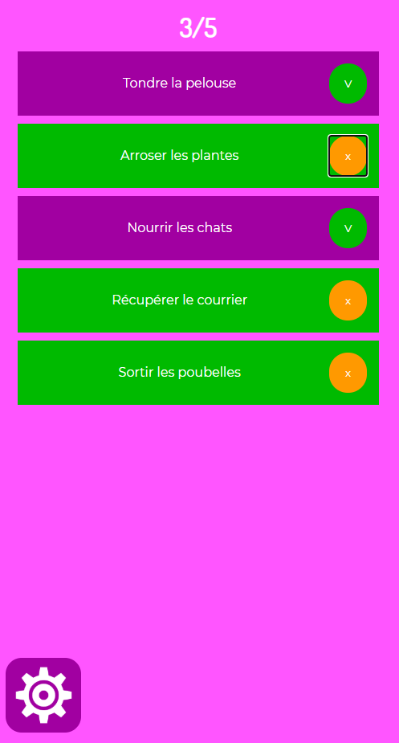

# K-Day
Lien PlayStore: https://play.google.com/store/apps/details?id=kiitoss.k.day

## Affichage des tâches journalières

## Gestion des tâches

## Création de nouvelles tâches

## Validation des tâches

## Améliorations possibles
- Envoie de tâche par message.